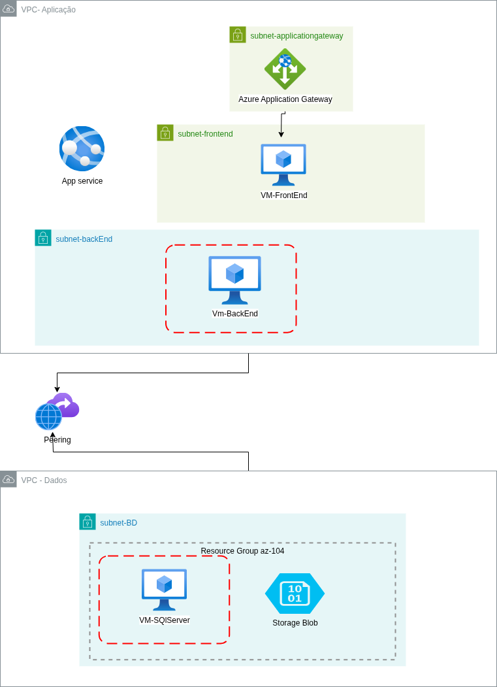

# Bootcamp Dio - Microsoft Azure Administrator Certification-(AZ104)

## ☁️ Infraestrutura no Azure – Projeto de Ambiente com Segurança, Escalabilidade e Alta Disponibilidade

Projetinho simples com uma equência de capturas de telas, para executar no provedor cloud Azure a seguinte arquitetura abaixo:



<br>

🗺️ Visão Geral da Arquitetura que desenhei para ser implantada no Azure.


Este projeto simula uma arquitetura de aplicação distribuída na nuvem Azure, com foco em separação de camadas, segurança e escalabilidade. A arquitetura está dividida em duas VPCs (redes virtuais):

🔹 ***Virtual networks***

Para esta arquitetura foi criado duas Virtual Networks(VPC).

   * Virtual Networks Dados.
     * com IP definido 10.1.0.0/16.


   * Virtual Networks Aplicação.
     * com IP definido 10.2.0.0/16.


🔹 ***VPC - Aplicação***
Resposável por hospedar os recursos da camada de aplicação:

  * Azure Application Gateway

    * Controla o tráfego de entrada.

    * Realiza balanceamento de carga e encaminha para o destino correto.


  * subnet-frontend.


  * Contém a VM VM-FrontEnd, que recebe as requisições do Gateway.


  * subnet-backend


  * Contém a VM VM-BackEnd, responsável pelo processamento da lógica da aplicação.


  * App Service

    * Representa um serviço web adicional, preparado para "futura integração" com o API Management(API Gateway) melhorarando a arquitetura com foco em serviços PaaS e governança de APIs.
    Servirá como uma camada de gerenciamento e exposição das APIs do App Service.
    Permitirá controle de acesso, versionamento, aplicação de políticas de segurança, cache e limitação de requisições (rate limiting).
    Pensando na necessidade da VM-BackEnd possui uma API qualquer. Será possível migrar essa API para o App Service e expô-la pelo API Management. Desta forma, outras aplicações ou clientes poderão consumir essa API com segurança e controle de acesso centralizado.

    

🔹 VPC - Dados.
Esta VPC será resposável por armazena os dados da aplicação:

  * subnet-BD.


  * Contém a VM VM-SQLServer, onde está o banco de dados.


    * Inclui também um Storage Blob, usado para armazenar arquivos e dados não estruturados.Neste caso para armazenar os backups do Banco de Dados e os logs do mesmo.


**Observação Importante:**
  * Para todos os recursos foram criadas as devidas tags.
    📌 Usadas com o próposito de facilitar encontrar e entender o propósito dos recursos.


   

🔗 Comunicação entre VPCs

   * A comunicação entre a VPC de Aplicação e a VPC de Dados é feita através de Peering, permitindo que as VMs troquem dados de forma segura e privada.Já que temos outros meios para acessos externos.
      * VPC Dados:


      * VPC Aplicação:


✅ Com esta arquitetura que desenhei espero ter alguns Benefícios como:

   🔐 Segurança: Camadas separadas por sub-redes e grupos de segurança.

   📈 Escalabilidade: Uso de Application Gateway com regras configuráveis.

   ↺ Organização: Cada função da aplicação está isolada em sua própria camada.

   🌐 Alta Disponibilidade: Possível escalar horizontalmente com balanceamento de carga.


ℹ️  Observação sobre a Criação dos Recursos.
   Os recursos utilizados nesta arquitetura foram criados diretamente através do Portal do Azure, sem o uso de scripts de automação (como ARM, Bicep ou Terraform).


⚙️ Instruções de Criação dos Recursos no Azure.

   Para fins de testes academicos utilizei a linha de comando para criar a mesma infraestrutra.Desta forma pude observar que a criação se deu mais rápida e bem estruturada com passos bem definidos através da cadeia de comandos.

   Requisitos: Azure CLI, permissões suficientes no portal Azure e uma conta ativa.

💻 Instalar o Azure CLI.
  O Azure CLI é a interface de linha de comando usada para interagir com os serviços do Azure.

   * Windows.
        Acesse: https://aka.ms/installazurecliwindows        

      Baixe e execute o instalador.
      Após instalar, reinicie o terminal (cmd, PowerShell ou Windows Terminal).

   * Linux (Ubuntu/Debian).

``` bash
curl -sL https://aka.ms/InstallAzureCLIDeb | sudo bash

```

   * macOS.

``` bash 

brew update && brew install azure-cli

```

   * Verificar a instalação.

```bash

az version

```

   * Autenticar no Azure.

```bash

az login

```
Isso abrirá uma janela do navegador para você autenticar com sua conta da Microsoft.

Em seguida execute os camandos abaixo nesta ordem,pois alguns recursos dependem da criação de outro antes".

1. Cria Resource Group:

```bash

az group create --name az-104 --location "Brazil South"

```

2. Cria a Virtual Network e Subnets:

```bash

az network vnet create \
  --name vnet-aplicacao \
  --resource-group az-104 \
  --address-prefix 10.2.0.0/16 \
  --subnet-name subnet-frontend \
  --subnet-prefix 10.2.1.0/24

az network vnet subnet create \
  --name subnet-backend \
  --vnet-name vnet-aplicacao \
  --resource-group az-104 \
  --address-prefix 10.2.2.0/24

```

3. Cria a VNet de dados e Peering:

```bash

az network vnet create \
  --name vnet-dados \
  --resource-group az-104 \
  --address-prefix 10.3.0.0/16 \
  --subnet-name subnet-bd \
  --subnet-prefix 10.3.1.0/24

# Peering bidirecional
az network vnet peering create \
  --name app-to-data \
  --resource-group az-104 \
  --vnet-name vnet-aplicacao \
  --remote-vnet vnet-dados \
  --allow-vnet-access

az network vnet peering create \
  --name data-to-app \
  --resource-group az-104 \
  --vnet-name vnet-dados \
  --remote-vnet vnet-aplicacao \
  --allow-vnet-access

```

4. Cria as VMs e Application Gateway.

   * Criar a vm-frontend.

```bash
az vm create \
  --resource-group az-104 \
  --name vm-frontend \
  --image UbuntuLTS \
  --vnet-name vnet-aplicacao \
  --subnet subnet-frontend \
  --admin-username azureuser \
  --authentication-type ssh \
  --generate-ssh-keys

```

   * Cria a vm-backend.

```bash

az vm create \
  --resource-group az-104 \
  --name vm-backend \
  --image UbuntuLTS \
  --vnet-name vnet-aplicacao \
  --subnet subnet-backend \
  --admin-username azureuser \
  --authentication-type ssh \
  --generate-ssh-keys

```
   * Cria a vm-sqlserver.
 
 ```bash

 az vm create \
  --resource-group az-104 \
  --name vm-sqlserver \
  --image MicrosoftSQLServer:SQL2019-WS2019:Enterprise:latest \
  --vnet-name vnet-dados \
  --subnet subnet-bd \
  --admin-username azureuser \
  --admin-password MinhaSenhaForte123! \
  --public-ip-sku Standard

```
Quanto ao  Application Gateawy é recomendo utilizar o portal para configurar devido as regras de roteamento, conforme arquitetura proposta.Aqui também não indiquei no comando para criação das vms parametros mais avançados, apenas fiz a criação de forma bem mais simples para fins acâdemicos mesmo.Mas claro é possivél indicar parametros mais avançados!


📊 Resultado Esperado

   Tráfego externo acessa o Application Gateway, que redireciona para o FrontEnd.
   O FrontEnd se comunica com o BackEnd, que consome dados da VM-SQLServer via peering.

   O App Service poderá futuramente ser acessado via API Management, proporcionando um ponto central de acesso e controle para APIs REST da aplicação.

   Possível escalar VMs ou usar instâncias gerenciadas para maior disponibilidade.

📙 Reforçando...

Projeto educacional para fins de estudo.
    


